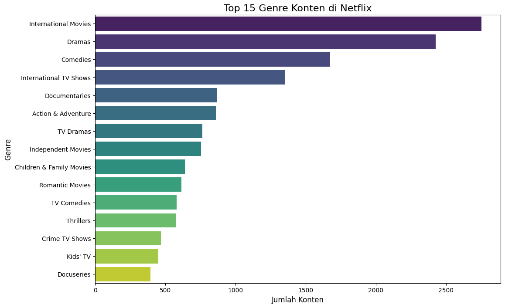
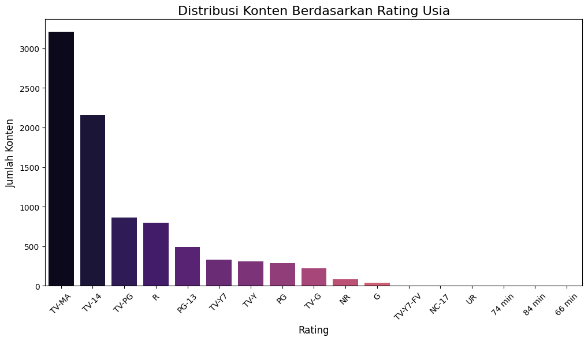
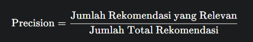

# Laporan Proyek Machine Learning: Sistem Rekomendasi Film Netflix - Putu Yoga Suartana

## Project Overview

Di era digital saat ini, layanan streaming seperti Netflix telah mengubah cara kita mengonsumsi hiburan. Namun, dengan katalog yang berisi ribuan judul, pengguna sering kali menghadapi kesulitan untuk menemukan tontonan yang sesuai dengan selera mereka, sebuah fenomena yang dikenal sebagai paradox of choice. Keterlibatan dan retensi pengguna pada platform ini sangat bergantung pada kemampuan platform untuk menyajikan konten yang relevan secara personal.

Sistem rekomendasi adalah solusi teknologi yang menjawab tantangan ini. Menurut riset dari eksekutif Netflix, sistem ini menjadi motor penggerak lebih dari 80% total jam tayang di platform mereka, yang menggarisbawahi nilai bisnisnya yang sangat signifikan. Rekomendasi yang efektif tidak hanya meningkatkan kepuasan tetapi juga menjadi pilar utama dalam strategi bisnis layanan streaming.

Proyek ini berfokus pada perancangan sebuah model sistem rekomendasi film menggunakan dataset publik Netflix. Melalui penerapan teknik machine learning, khususnya Content-Based Filtering, proyek ini akan mengembangkan dan mengevaluasi solusi untuk memberikan rekomendasi film yang dipersonalisasi kepada pengguna.

**Referensi**:

Gomez-Uribe, C. A., & Hunt, N. (2015). The Netflix recommender system: Algorithms, business value, and innovation. ACM Transactions on Management Information Systems (TMIS), 6(4), 1-19. https://doi.org/10.1145/2843948

## Business Understanding

### Problem Statements

Berdasarkan konteks di atas, masalah yang akan diselesaikan dalam proyek ini dirumuskan sebagai berikut:
- Bagaimana merancang sebuah sistem yang dapat memberikan rekomendasi film kepada pengguna berdasarkan kemiripan konten (seperti genre, deskripsi, sutradara, dan pemeran)?
- Bagaimana mengevaluasi dan membandingkan dampak dari dua teknik representasi fitur teks yang berbeda terhadap akurasi rekomendasi yang dihasilkan?

### Goals

Untuk menjawab pernyataan masalah tersebut, tujuan dari proyek ini adalah:
- Membangun model sistem rekomendasi fungsional menggunakan pendekatan Content-Based Filtering.
- Menganalisis performa dua model yang dibangun dengan teknik vektorisasi yang berbeda (CountVectorizer dan TF-IDF) untuk menentukan pendekatan yang lebih optimal untuk dataset ini.

### Solution statements
Untuk mencapai tujuan yang telah ditetapkan, proyek ini akan mengimplementasikan dua solusi berbasis Content-Based Filtering. Kedua solusi ini akan menggunakan alur kerja yang sama namun dibedakan oleh teknik vektorisasi fiturnya:

- Pendekatan A (Bag of Words): Model pertama akan menggunakan CountVectorizer untuk mengubah metadata teks menjadi vektor berdasarkan frekuensi kemunculan kata.
- Pendekatan B (TF-IDF): Model kedua akan menggunakan TF-IDF Vectorizer untuk memberikan bobot pada kata berdasarkan relevansinya dalam sebuah film dan keunikannya di seluruh dataset.

Perbandingan kedua pendekatan ini akan memberikan wawasan mengenai teknik representasi fitur mana yang lebih efektif untuk kasus ini.

## Data Understanding

Tahap ini berfokus pada eksplorasi dan pemahaman Netflix Movies and TV Shows Dataset yang menjadi dasar proyek ini.

Sumber Dataset: Dataset ini bersumber dari Kaggle dan dapat diakses melalui tautan: [Netflix Movies and TV Shows Dataset](https://www.kaggle.com/datasets/shivamb/netflix-shows)

Dataset awal terdiri dari 8807 data konten Netflix dengan 12 fitur. Setelah dilakukan pemfilteran untuk hanya menggunakan data film, dataset yang diolah memiliki 6131 baris. Analisis awal menunjukkan adanya nilai yang hilang (missing values) pada beberapa fitur seperti `director` dan `cast`, yang akan ditangani pada tahap persiapan data.

**Variabel-variabel** pada Netflix Movies and TV Shows dataset adalah sebagai berikut:
- `show_id`: ID unik untuk setiap konten.
- `type`: Jenis konten (Movie atau TV Show).
- `title`: Judul film atau acara TV.
- `director`: Nama sutradara.
- `cast`: Daftar nama pemeran.
- `listed_in`: Kategori genre konten.
- `description`: Sinopsis singkat cerita.

**Exploratory Data Analysis (EDA)**

- Distribusi Genre Konten di Netflix

Insight: Visualisasi di atas menunjukkan bahwa kategori International Movies dan Dramas mendominasi katalog Netflix, yang mengindikasikan strategi konten yang berfokus pada pasar global dan cerita berbasis narasi.

- Distribusi Konten Berdasarkan Rating Usia

Insight: Sebagian besar konten memiliki rating TV-MA (Dewasa) dan TV-14 (Remaja 14+), yang menyiratkan bahwa target audiens utama platform ini adalah kalangan dewasa dan remaja.

## Data Preparation
Tahap persiapan data bertujuan untuk mengubah data mentah menjadi dataset yang bersih dan terstruktur untuk pemodelan. Langkah-langkah yang dilakukan adalah sebagai berikut:

1. Penanganan Nilai yang Hilang: Untuk menjaga integritas data dan mencegah error, nilai yang hilang pada kolom-kolom kunci seperti director dan cast diisi dengan string kosong.
2. Rekayasa Fitur (Feature Engineering): Proses ini berfokus pada pembuatan fitur baru yang komprehensif.
    - Pembersihan Teks: Spasi pada nama orang (sutradara, pemeran) dan genre dihilangkan untuk memastikan entitas tersebut dianggap sebagai satu token tunggal (misalnya, DavidFincher).
    - Pembuatan Kolom tags: Fitur-fitur teks yang relevan (genres, description, cast, director) digabungkan menjadi satu kolom tunggal bernama tags. Kolom ini menciptakan representasi konten holistik untuk setiap film, yang menjadi input utama untuk model.
3. Reset Indeks DataFrame: Setelah melakukan pemfilteran dan persiapan, indeks DataFrame di-reset untuk memastikan urutan yang konsisten dan mencegah IndexError saat pemodelan.

Dengan selesainya tahapan ini, dataset telah siap untuk digunakan dalam proses modeling.

## Modeling
Tahap ini berfokus pada implementasi dan perbandingan dua model sistem rekomendasi berbasis konten. Pendekatan ini dipilih karena kemampuannya merekomendasikan item berdasarkan atribut intrinsik film, seperti genre dan pemeran, tanpa memerlukan data historis pengguna.

**Model 1**: Content-Based Filtering dengan TF-IDF
Model pertama menggunakan teknik TF-IDF untuk mengubah fitur teks menjadi representasi numerik.

- Proses: Kolom tags divektorisasi menggunakan TfidfVectorizer, yang memberikan bobot lebih tinggi pada kata-kata yang unik dan signifikan. Selanjutnya, kemiripan antar film dihitung menggunakan metrik Cosine Similarity.
- Tujuan: Pendekatan ini diharapkan mampu menangkap nuansa konten dengan memberikan penekanan pada fitur-fitur teks yang lebih spesifik.

**Model 2**: Content-Based Filtering dengan CountVectorizer (Bag of Words)
Model kedua menggunakan teknik CountVectorizer sebagai metode alternatif.

- Proses: Berbeda dengan TF-IDF, pendekatan ini hanya menghitung frekuensi kemunculan setiap kata dalam kolom tags tanpa pembobotan. Matriks kemiripan juga dihitung menggunakan Cosine Similarity.
- Tujuan: Model ini dibangun sebagai pembanding untuk melihat apakah representasi fitur yang lebih sederhana sudah cukup efektif untuk kasus ini.

**Hasil Rekomendasi**

Kedua model diuji untuk memberikan rekomendasi film yang mirip dengan 'The Social Network':

**Rekomendasi dari Model 1 (TF-IDF)**:

- The Music of Silence
- Nothing to Lose
- The End of the Tour
- Justin Timberlake + the Tennessee Kids
- Tiffany Haddish: She Ready! From the Hood To Hollywood!

**Rekomendasi dari Model 2 (CountVectorizer)**:

- Nothing to Lose
- The Music of Silence
- The End of the Tour
- Ani... Dr. Kashinath Ghanekar
- Curtiz

**Kelebihan dan Kekurangan Pendekatan**

**Kelebihan**:

1. Independen dari Data Pengguna Lain: Rekomendasi dihasilkan hanya berdasarkan konten, sehingga tidak memerlukan data historis dari pengguna lain.
2. Rekomendasi Item Niche: Mampu merekomendasikan item yang kurang populer selama memiliki atribut yang relevan.
3. Interpretasi Mudah: Hasil rekomendasi dapat dijelaskan dengan mudah berdasarkan kesamaan fitur (misalnya, "direkomendasikan karena memiliki sutradara dan genre yang sama").

**Kekurangan**:

1. Keterbatasan Penemuan Baru (Serendipity): Cenderung merekomendasikan item yang sangat mirip, sehingga mengurangi kemungkinan pengguna menemukan konten yang benar-benar baru dan berbeda.
2. Ketergantungan pada Kualitas Metadata: Kinerja model sangat dipengaruhi oleh kelengkapan dan kualitas data fitur yang tersedia.

## Evaluation
Untuk mengukur performa kedua model secara kuantitatif, metrik Precision digunakan.

**Formula dan Cara Kerja**
- Formula: 
- Definisi Relevansi: Dalam konteks proyek ini, sebuah film yang direkomendasikan dianggap "relevan" jika memiliki minimal satu genre yang sama dengan film yang menjadi acuan. Metrik ini dipilih karena selaras dengan tujuan bisnis untuk memberikan rekomendasi yang tematik dan sesuai dengan preferensi genre pengguna.

**Hasil Evaluasi**

Berdasarkan pengujian pada film 'The Social Network' (genre: Dramas), hasil evaluasi adalah sebagai berikut:

- Model 1 (TF-IDF): Nilai Precision @5 adalah 0.60. Ini berarti 3 dari 5 film yang direkomendasikan memiliki genre yang relevan. Dua rekomendasi lainnya (`Justin Timberlake +...` dan `Tiffany Haddish...`) tidak memiliki irisan genre.
- Model 2 (CountVectorizer): Nilai Precision @5 adalah 1.00. Ini berarti semua 5 film yang direkomendasikan memiliki genre yang relevan, menunjukkan kinerja yang sempurna pada kasus uji ini.

**Analisis Hasil Evaluasi**:

Model CountVectorizer (Bag of Words) menunjukkan performa yang lebih unggul dalam kasus ini. Hal ini kemungkinan disebabkan karena TF-IDF memberikan bobot yang tidak proporsional pada kata-kata unik (seperti "music" atau "stand-up"), yang menyebabkan rekomendasi dari genre lain muncul. Sebaliknya, CountVectorizer yang fokus pada frekuensi kata berhasil mengidentifikasi kemiripan berdasarkan fitur dominan seperti genre Dramas dan nama sutradara/aktor.
